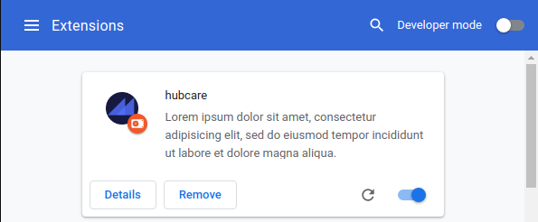

# HubCare

<div style="text-align:center"></div>

O Hubcare é um projeto de código aberto destinado a ajudar os usuários de software livre e possíveis colaboradores a decidir quais repositórios devem usar ou em quais devem contribuir. Ele tem uma API que extrai dados da GithubAPI e os envia para um Plugin de Chrome. Mais detalhes sobre o projeto podem ser encontrados nessa documentação.

---------

# Guia de Instalação

## Instalação da Chrome Store

Apenas vá até nossa página na [Chrome Store](https://github.com/fga-eps-mds/2019.1-hubcare-plugin) e seja feliz :D

A pipeline de entrega está configurada para que o [código do Plugin](https://github.com/fga-eps-mds/2019.1-hubcare-plugin) seja postado na [Chrome Store](https://github.com/fga-eps-mds/2019.1-hubcare-plugin) sempre que uma [Release Note](https://github.com/fga-eps-mds/2019.1-hubcare-plugin/releases) é publicada. Isso garante que você esteja com um código estável mais atualizado possível.

## Rodando o código localmente

Gostaria de ver o sistema funcionando na sua máquina?

Infelizmente, o Plugin não foi feito para interagir com a API de maneira local. O código do Plugin está configurado para procurar o domínio do Hubcare. Além disso, para autenticar de maneira correta, é necessário configurar algumas constantes no código que não devem ser commitadas. Mais detalhes adiante.

Para instalação dos componentes, [Docker](https://docs.docker.com/install/) e [Docker-Compose](https://docs.docker.com/compose/install/) serão uma mão na roda! As instruções a partir daqui serão utilizadas com essas ferramentas.

### Rodando a API

Baixe o código na máquina.

```bash
cd ~/seu/diretório/preferido/
git clone https://github.com/fga-eps-mds/2019.1-hubcare-api.git
cd 2019.1-hubcare-api
```

Agora é só deixar o Docker fazer a mágica:

```bash
docker-compose build
docker-compose up
```

Se tudo tiver dado certo, a API Hubcare agora estará rodando em sua máquina. É só checar em `0.0.0.0:8000`. Existem serviços rodando da porta 8000 até a 8005.

Recomendo que teste nesse repo: http://0.0.0.0:8000/hubcare_indicators/fga-eps-mds/2019.1-hubcare-api

### Rodando o Plugin

Baixe o código na máquina

```bash
cd ~/seu/diretório/preferido/
git clone https://github.com/fga-eps-mds/2019.1-hubcare-plugin.git
cd 2019.1-hubcare-plugin
```

E mais uma vez, Docker salva o dia:

```bash
docker-compose build
docker-compose up
```

Após a execução desses comandos, uma pasta chamada `dist/chrome/` será criada na raiz do projeto. Para executá-la no Chrome, vá na URL [chrome://extensions/](chrome://extensions/). No canto superior direito, ative o Modo de Desenvolvedor. Isso habilitatá alumas opções especiais. Clique em "Load unpacked" e selecione a pasta gerada pelos comandos anteriores.



Se tudo tiver dado certo, agora você verá o Hubcare como opção e basta ativá-lo!

#### Comandos do Docker no Plugin

Para executar outros comandos, use

```bash
docker-compose exec hubcareplugin <command>
```

por exemplo:

```bash
docker-compose exec hubcareplugin npm install
```

**Observação: Embora o plugin tenha sido desenvolvido com foco do Chrome, é possível gerar um executável para outros navegadores. Entretanto, não há qualquer garantia de um bom funcionamento.**

```bash
npm run dev chrome
npm run dev firefox
npm run dev opera
npm run dev edge
```

#### Lidando com autorização

A autorização utiliza o OAuth do GitHub, para isso é necessário criar um [App Oauth](https://github.com/settings/developers), como no exemplo abaixo:


Com o app criado, apenas insira o **CLIENT_ID** e o **CLIENT_SECRET** no arquivo `app/scripts/constants.js`, desse modo:

```js
module.exports = {
    CLIENT_ID: 'XXXXXXXXXXXX',
    CLIENT_SECRET: 'XXXXXXXXXXXXXXXXXXXXX'
}
```

Caso queira contribuir, **não commite esse arquivo!**