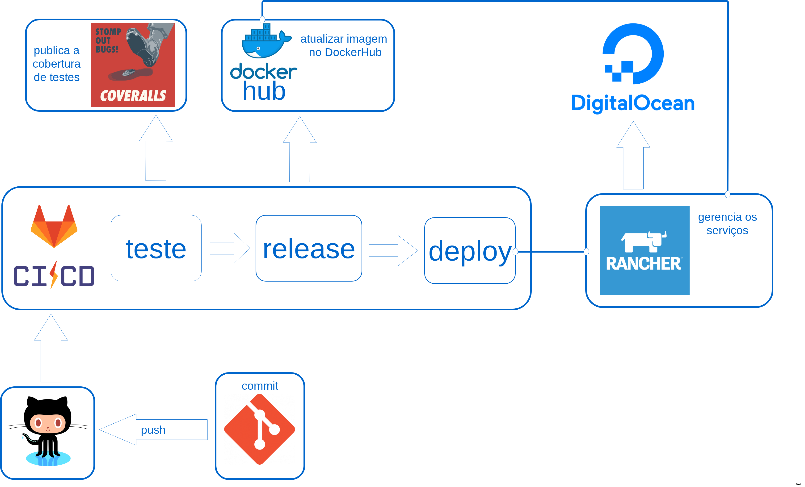

# Pipeline da api

## Explicação sobre os estágios:

* **teste:** testes de unidade executam e publicam cobertura de teste no coveralls; 
* **release:** gera uma build do aplicativo e publica no dockerhub, são gerados apenas no branch master e devel; 
* **deploy**: atualiza a versão do sistema no deploy, são gerados apenas no branch master e devel (em desenvolvimento)