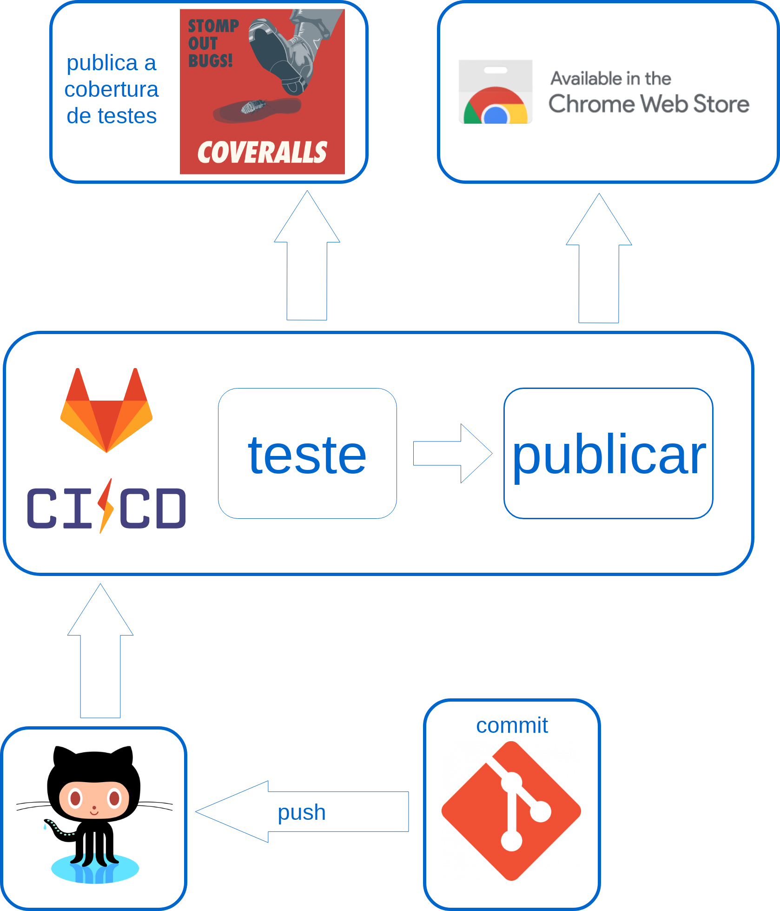

# Pipeline do plugin de chrome

<!--  -->

<iframe frameborder="0" style="width:100%;height:516px;" src="https://www.draw.io/?lightbox=1&highlight=0000ff&edit=_blank&layers=1&nav=1&title=pipeline%20plugin#Uhttps%3A%2F%2Fdrive.google.com%2Fuc%3Fid%3D1MIYlyS-hRLhXL6E_QW0VN7YmHnUUDcga%26export%3Ddownload"></iframe>

## Explicação sobre os estágios:

* **teste:** testes de unidade executam e publicam cobertura de teste no coveralls;
* **release:** gera uma compilação do aplicativo e publica na chrome store, são gerados apenas no branch master e devel; 
