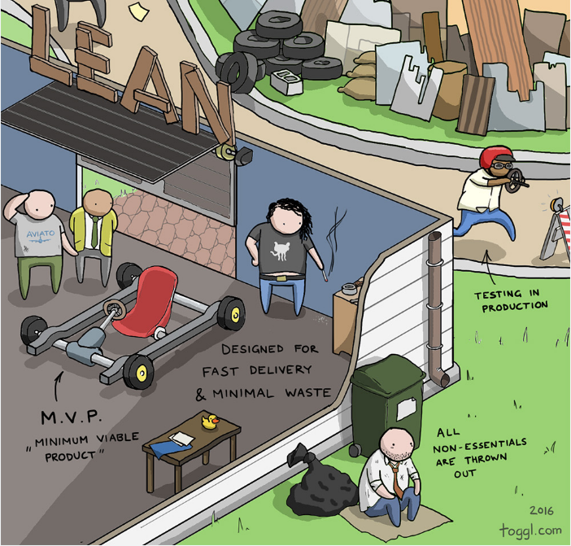
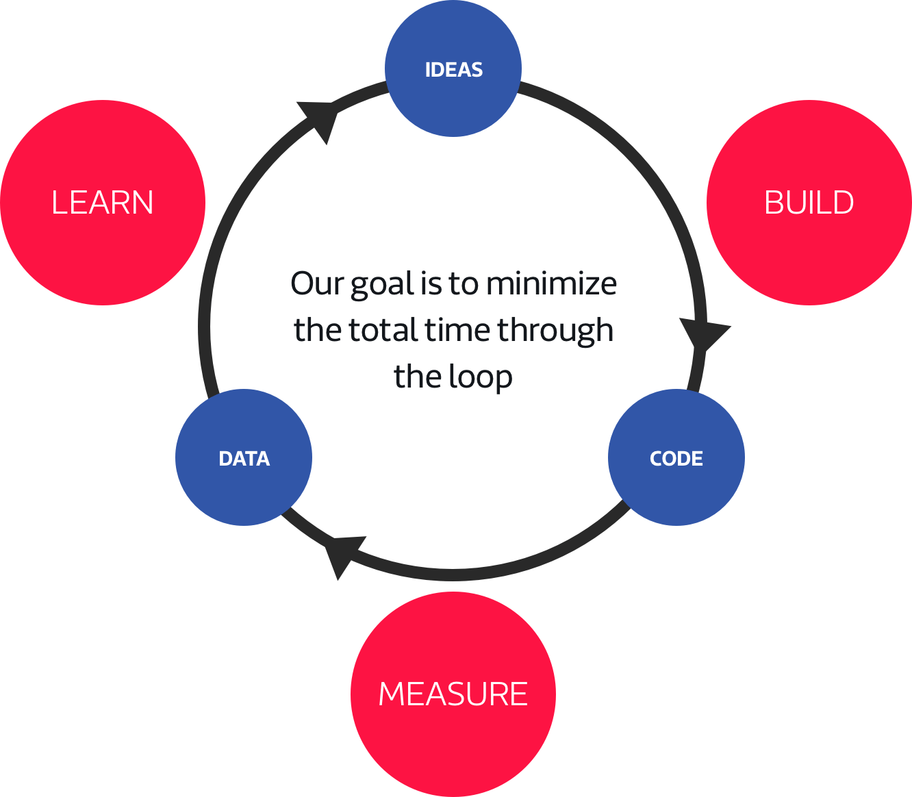
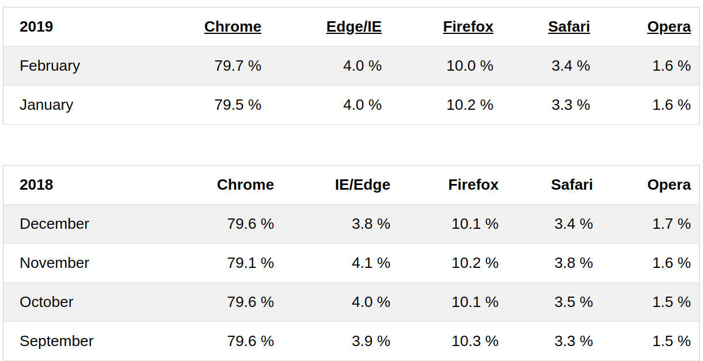

# Roadmap de Produto

**Autor: Filipe Toyoshima**

## Introdução

O Roadmap de Produto, em termos tradicionais, é um documento que exibe um caminho, uma sequência de atividades ao longo do tempo para que o produto ao qual se refere seja entregue em um determinado escopo de tempo.

Normalmente, o Roadmap é uma das formas de se planejar o produto, desde sua concepção até sua finalização. Entretanto, isso nos lembra muito os métodos tradicionais de Engenharia de Software, onde há uma sequência de passos pré-determinados que levam ao objetivo final do projeto. Não é assim que se trabalha nas metodologias ágeis.

Para elaboração do produto deste projeto, serão utilizados alguns dos princípios Lean, ilustrados brilhantemente pelo [blog Toggl](https://toggl.com/developer-methods-infographic/).

Uma outra ilustração um pouco menos jocosa (mas não tão pouco) sobre os princípios Lean foi usada por [Jeff Gothelf](https://www.jeffgothelf.com/blog/), autor de *Lean UX*, em seu [artigo na Medium](https://medium.com/@jboogie/what-does-an-agile-product-roadmap-look-like-cf0dbe5be4ef):

Visto isso, nota-se um planejamento a longo prazo em termos de features do produto não se faz necessários, podendo até mesmo ser um erro, uma vez que o produto aqui descrito se trata de uma inovação.

*Erre, mas erre cedo!*

Uma vez que os erros foram cometidos, é necessários entendê-los aprender com eles.

Pensando nisso, temos que planejar por onde começar a errar, para que as experimentações sejam significativas para a validação e construção de um produto de qualidade para o usuário.

## Roadmap Inicial

O planejamento conta com passos de alto nível de abstração, que se referem a outras partes do projeto já documentadas.

<iframe frameborder="0" style="width:100%" src="https://www.draw.io/?lightbox=1&highlight=000000&layers=1&nav=1&title=Product%20Roadmap.drawio#Uhttps%3A%2F%2Fdrive.google.com%2Fuc%3Fid%3D1LfVQUN_wz5rKCXMoNggUARRcwP3ucQ3m%26export%3Ddownload"></iframe>

O Roadmap é dividio em três níveis: planejamento, preparação, e pivotagem. Quanto mais se desce no diagrama, mais maleáveis são as ideias.

### Planejamento

O planejamento se refere a entender os objetivos finais do projeto, aquilo que tem que ser alcançado.

Inicia-se com a visão, descrita em mais detalhes no [Documento de Visão](../project/vision-document/README.md). Essa visão refere-se à parte mais rígida do planejamento, pois se a visão do produto se altera um pouco, todo o resto terá que se adequar.

Para alcançar a visão, foram separados quatro objetivos. Assim como na visão, todo o resto é pensado com base neles.

Como o projeto se trata de entender um domínio, que é a saúde de repositórios, faz sentido incluir, ainda na fase de planejamento, a elaboração de um [Plano de Medição](https://fga-eps-mds.github.io/2019.1-hubcare-docs/project-quality-management/measurement-model/).

### Preparação

A preparação se refere a montar a estrutura para que possam se iniciar a pivotagem. Como o projeto deverá prover uma visão para usuários do GitHub, planejar a estrutura para editar páginas do site será essencial para os primeiros testes.

#### API HubCare + GitHub API

Para a primeira pivotagem, é necessário que alguns dados já estejam respondendo as perguntas levantadas durante o planejamento, na parte de [Plano de Medição](https://fga-eps-mds.github.io/2019.1-hubcare-docs/project-quality-management/measurement-model/). Lá são indicadas três perguntas, cada uma delas com suas métricas que, por sua vez, podem responder a mais de uma pergunta cada. Sabendo disso, e também que as métricas terão que ser ajustadas ao longo do tempo, foram planejadas respostas para todas as perguntas do Plano de Medição para a primeira pivotagem.

#### Plugin para Chrome

Para que se tenha algo que se possa validar com o usuário, é necessário que se tenha alguma informação renderizada na tela.

A ideia dos objetivos é que eles modifiquem a página dos repositórios onde o usuário entrar. A opção de melhor viabilidade técnica, descrita no [Documento de Arquitetura](../project/architecture-document/README.md), foi um plugin para navegador, pois ele tem como característica essencial modificar a linguagem de marcação renderizada.

Como primeiro navegador a ser testado, o Google Chrome foi escolhido. Além de fornecer um excelente suporte a plugins, é também o navegador mais utilizado atualmente segundo [post da W3Schools](https://www.w3schools.com/browsers/).

### Pivotagem

A pivotagem é um passo essencial no Lean, pois se trata de verificar se a solução realizada atende os objetivos propostos e, também, se os objetivos contemplam a visão do projeto.

#### Badges

A primeira pivotagem se refere às badges que resumem a qualidade de um repositório. Através disso, é possível verificar se a solução de modificar as páginas do GitHub agrada os usuários.

Existe um [Modelo de Teste de Aceitação](../project-quality-management/acceptance-test-model/README.md) a ser seguido para validação das features testadas.

### Próximas Etapas

Por mais que o Lean concentre-se em planejar as coisas aos poucos para que não se tomem decisões comprometedoras das quais o time pode se arrepender posteriormente, é importante elicitar no roadmap quais são as possíveis features que resolverão objetivos ainda não contemplados na primeira pivotagem.

#### Aba de Detalhamento com os Gráficos

Depois da primeira pivotagem planejada, ainda restará um objetivo para ser concluído, que podederá ser resolvido através de auxílio de gráficos. Esses gráficos terão de ser renderizados numa nova aba do GitHub, colocada lá pelo Plugin utilizado no Chrome.

É claro que a execução dessa parte do trabalho é dependente dos resultados da primeira pivotagem, mas a expectativa é que as alterações no que foi planejado para teste inicial sejam pequenas e que o time possa trabalhar em paralelo nessas alteraçõe e nas features que serão incluídas para as próximas.