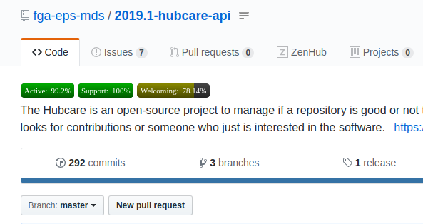

# Teste de Aceitação 1

**Autor: Filipe Toyoshima**

## Introdução

Este documento visa expor os resultados adquiridos durante o primeiro teste de aceitação do Projeto Hubcare. Os testes seguem um [modelo de testes](../../acceptance-test-model/README.md) que visam validar se o atual estado do projeto é capaz de atender sua [visão](../../../project/vision-document/README.md).

| | |
| -- | -- |
| Data e Horário dos Teste | 03/05/2019 15:10 |
| Quantidade de Participantes | 2 EPS + 2 MDS |
| Versão testada | 0.1 |

### Participantes

| Participante | Papel |
| -- | -- |
| Filipe Toyoshima | Product Manager |
| Cleber Castro | DevOps |
| Vitor Alves | Desenvolvedor |
| Vitor Meireles | Desenvolvedor |

### Usuário de Teste

Participou desta sessão de teste apenas um usuário em potencial da aplicação. Ele, inclusive, é um dos que identificaram o problema que idealizou a solução.

Como há poucas funcionalidades a serem testadas, preferiu-se manter o público de teste mais restrito.

## Escopo

A primeira versão a ser testada é minimalista, no sentido de que oferece o mínimo viável para que o usuário possa sentir algum benefício.

A única feature testada, a nível de usuário, foi a exibição de badges que respondem as três perguntas colocadas no GQM ([Documento de Medição](../../measurement-model/README.md)).

## Metodologia

Como o único usuário de teste já conhecia a ideia da aplicação, não houve qualquer explicação do que a ferramenta se propunha. Apenas um aviso de que ela já estava instalada na máquina onde foram realizados os testes e já estava operando. Não foi revelado o que aconteceria, onde as badges seriam realizadas, quanto tempo demoraria e nem nada do tipo. A ideia era testar o quão intuitiva a ferramenta estava. A ferramenta foi apenas entregue para o usuário testá-la e tentar inferir algum dado a partir de suas funcionalidades.

O teste ocorreu no laboratório de software onde o próprio usuário trabalha. A escolha se deu pela familiaridade do usuário para com o local.

A máquina onde os testes rodaram é de posse de um dos membros da equipe, e nela se encontrava instalado um software para gravação da tela, voz e webcam. Entretanto, o usuário se sentiu desconfortável com a ideia de seu rosto ser gravado. Analisando os resultados do teste, a equipe constata ainda que isso não prejudicou a obtenção de dados e pode até ser retirada do Modelo de Testes.

## Comentários dos Usuários

> Não existe nenhum feedback para mostrar onde as badges estão sendo carregadas, ou mesmo se estão sendo carregadas

Esse comentário se deve ao fato de que o usuário não tem a sensação do que está acontecendo enquanto os dados são processados. E, de fato, enquanto isso acontece, existe apenas um espaço vaziou onde deveriam se encontrar as badges. Esse problema é ainda mais agravado pelo fato de que o servidor de homologação às vezes simplesmente para.

> Carregamento muito lento

Os algoritmos utilizados para cálculo certamente não são os mais otimizados o possível. Isso, somado ao fato de que não há feedback sobre o carregamento das informações, gera ainda mais a sensação de que a ferramenta não está funcionando.

> Clicar no ícone do Plugin abre um Popup aleatório. Eu procurava por ajuda lá.

O Plugin gera um botão no navegador, assim como vários outros. Normalmente, a primeira ideia a ser testada é clicar nesse botão para ver o que acontece. Bom... só aparece um Popup escrito Popup.

> Eu gostaria de saber como essas badges são calculadas. Normalmente, clicar nelas me daria alguma informação.

É bem misteriosa a maneira como são calculadas as taxas. Até pra nós, desenvolvedores, é difícil dizer quais métricas estão causando que influências em cada taxa calculada.

## Conclusão

**A solução proposta resolve o problema do público-alvo?**

Não. A ideia parece estar no rumo correto, mas apenas os dados apresentados não são capazes de gerar confiança no usuário por conta da falta de detalhes.

**Existe uma maneira melhor de atacar o problema?**

Não foi indicada nenhuma maneira diferente de apresentar os dados.

**O usuário de teste sentiu falta de alguma coisa?**

Sim. Todas as faltas foram listadas nos [Comentários do usuário](#comentarios-dos-usuarios)

**O usuário de teste abdicou de usar alguma parte da solução?**

Não. Não havia muito do que abdicar.

### Features/Modificações Sugeridas

- Feedback visual de carregamento das métricas
- Explicação de uso ao clicar no botão do Plugin
- Otimização dos algoritmos
- Exibição das pontuações individuais de cada métrica