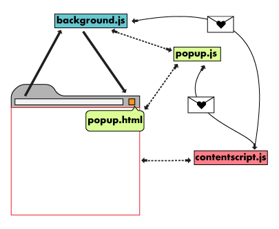

# Documento de arquitetura

## Histórico de Revisões

| Data | Versão | Descrição | Autor |
| :--: | :----: | :-------: | :---: |
|  30/03/2019    | 0.1    | Criação do documento e introdução | Vitor Alves e Vitor Meireles |
|  03/04/2019 | 0.2 | Adição de Restrições da Arquitetura  |  Vitor Meireles |
| 04/04/2019 | 0.3 | Adição da Representação da Arquitetura | Rômulo Souza e Vitor Meireles |
| 12/04/2019 | 0.4 | Adição do diagrama de classes | Brian, Cleber, Francisco, Rômulo e Vitor Meireles |
| 28/04/2019 | 0.5 | Atualização do diagrama de classes | Rômulo Souza |
| 28/04/2019 | 0.6 | Adição do diagrama de pacotes | Rômulo Souza |
| 28/04/2019 | 0.7 | Correção do diagrama de visão geral da arquitetura | Cleber Junior, Rômulo Souza |
| 28/04/2019 | 0.8 | Melhoria da representação arquitetural| Rômulo Souza |

## 1. Introdução

### 1.1. Finalidade

Este documento tem como objetivo descrever a arquitetura do plugin Hubcare. Ele apresenta as decisões de arquitetura para o projeto de forma objetiva e clara e também contém informações que servem de guia para desenvolvedores e gestores compreenderem o fluxo de informações e tecnologias envolvidas.

### 1.2. Escopo

Esse documento demostra as decisões tomadas sobre a organização arquitetural do Hubcare. Estão descritos neste documento: padrões adotados, _frameworks_ e linguagens escolhidas.

### 1.3. Definições, Acrônimos e Abreviações

* API - Application Programming Interface: conjunto de rotinas e padrões estabelecidos por um software para a utilização das suas funcionalidades por demais aplicativos que desejam utilizar seu serviço
* DRF - Django Rest Framework: framework de python utilizado para construção de web APIs
* MVC - Model View Controller: padrão de arquitetura de software constituído por três camadas
* DOM - Document Object Model: plataforma e interface que permite programas a acessar e atualizar o conteúdo, a estrutura e o estilo de um documento

### 1.4. Visão geral

O documento detalha a arquitetura utilizada no projeto. Para isso, é explicada a arquitetura individual dentro de cada tecnologia escolhida e como estas se encaixam no contexto. Depois do entendimento de cada tecnologia, é abordada uma visão lógica do projeto e uma visão geral representando todo fluxo de informações dentro do Hubcare, bem como todos os serviços utilizados e a visão de implementação dentro de cada tecnologia.

## 2. Representação da Arquitetura

### 2.1. Django Rest Framework

O DRF é um extensão do Django Framework e é utilizado para a construção de APIs em plataforma Web. Com esse, é possível criar um backend independente, através de serviços, podendo ser acessado por uma aplicação mobile ou web através de requisições do tipo REST. Uma arquitetura REST opera através de métodos de protocolo HTTP; como GET, POST, PUT, DELETE, entre outros.

A arquitetura do DRF é baseada na arquitetura MVC, onde a camada da controller ocorre internamente ao framework, de forma automática. Uma boa prática utilizada no DRF é representar cada funcionalidade através de um app interno, para melhor modularização do sistema.

A model do DRF é a camada responsável por gerir, modelar e persistir os dados. Tem como principais funções controlar o estado dos dados, responder a instruções para mudança de estado dos dados e cuidar das regras de negócio da aplicação.

A view do DRF é a camada encarregada por interpretar entradas vindas de outros sistemas (através de endpoints), distribuindo comandos que geram atualização, busca de dados ou requisições em outras partes do próprio sistema ou de outro sistema que esteja sendo consumido, fazendo o uso das classes definidas na camada de modelo (model).

### 2.2. Plugin Google Chrome

Plugins para o google chrome são pequenos programas utilizados para customizar a experiência de um usuário ao ulitizar o browser. São extensões que permitem a utilização de novas funcionalidades.

Os plugins são feitos em tecnologias web, como HTML, CSS e JavaScript. No Hubcare, o plugin será responsável por trocar informações com o backend e mostrá-las na página acessada pelo usuário. Para isso, deve editar o conteúdo HTML presente na página, acrescentando as informações recebidas pelo backend. A arquitetura do plugin é composta por 4 componentes: popup.html, popup.js, background.js e contentscript.js.

* Popup.html - janela feita em HTML que sobrepõe o conteúdo da página
* Popup.js - controla as funcionalidades da popup.html
* Background.js - script responsável pelos eventos que ocorrem na página e precisam ser observados pelo plugin. O módulo background deve ficar desabilitado quando não é utilizado, e carregado apenas quando necessário.
* Contentscript.js - responsável pela leitura e escrita em uma página web. Ele lê e modifica o DOM de páginas web acessadas pelo browser.

### 2.3. API GitHub

A API do GitHub é consumida pelo backend do Hubcare. Os dados advindos da API são processados de acordo com os critérios adotados, presentes no [Plano de Medição](../../project-quality-management/measurement-model/README.md), gerando as métricas desejadas, que retornarão ao plugin do Chrome.

### 2.4. Cliente-servidor

O principal relacionamento do projeto é implementado como um cliente-servidor. O cliente é representado pelo plugin do chrome, que irá realizar uma requisição na API Gateway, que é o servidor central do projeto.

### 2.5. API Gateway

A API Gateway é a API central do projeto, uma fachada entre o frontend e os microsserviços. É responsável por verificar a existência do repositório solicitado, evitando requisições desnecessárias; coletar métricas dos microsserviços, através de requisições do tipo GET; processar as métricas coletadas e retornar indicadores para o plugin do chrome.

### 2.6. Microsserviços

Os microsserviços são responsáveis por coletar os dados da API do GitHub e transformá-los em métricas. Os microsserviços foram criados de acordo com as categorias obtidas através do [Plano de Medição](../../../project-quality-management/measurement-model/): issue, commit, pull_request e community. Dentro de cada microsserviço, existem as métricas correspondentes àquela categoria, representadas por APPs do DRF. Métricas correspondentes a cada microsserviço:

#### 2.6.1. Commit

* Quantidade de commits no último mês
* Quantidade de contribuidores no último mês

#### 2.6.2. Community

* Possui README
* Possui licença
* Possui descrição
* Possui release notes
* Possui código de conduta
* Possui template de issue
* Possui guia de contribuição
* Possui template de pull request

#### 2.6.3. Issue

* Taxa de issues ativas
* Taxa de good first issue
* Taxa de help wanted issue

#### 2.6.4. Pull Request

* Qualidade de aceitação de pull requests

### 2.7. Visão Geral da arquitetura

<iframe frameborder="0" style="width:100%;height:594px;" src="https://www.draw.io/?lightbox=1&highlight=0000ff&edit=_blank&layers=1&nav=1&title=eps_architecture.drawio#Uhttps%3A%2F%2Fdrive.google.com%2Fuc%3Fid%3D1vXER5G4wags_JHToZT-_3GOSGvpWjKYl%26export%3Ddownload"></iframe>

## 3. Metas e Restrições de Arquitetura

### 3.1. Tecnologias utilizadas para o desenvolvimento

| Tecnologias | Descrição |
| :--------: | --------- |
| HTML/CSS | Utilizado no desenvolvimento Web de forma padrão e estruturado |
| JavaScript | Utilizado no desenvolvimento Web de forma dinâmica |
| NodeJS | Utilizado para relizar o empacotamento da aplicação para a extensão do chrome, de forma automatizada |
| Web Extension | Biblioteca do NodeJS que auxilia no desenvolvimento, convertendo a estrutura do node para uma forma interpretável pela arquitetura do chrome |
| Python | Linguagem utilizada no desenvolvimento backend da aplicação |
| Django | Framework de desenvolvimento para web que faz uso do padrão model-template-view |
| Docker | Tecnologia de fornecimento de contêineres, adicionando uma camada de abstração, automação e virtualização ao S.O |
| Google Chrome | Navegador para aplicação do plugin |

### 3.2. O Plugin Hubcare possui as seguintes restrições de arquitetura

* Dependente de conexão com internet
* Versão do plugin apenas para o Google Chrome
* Número de requisições feitas para a API do GitHub limitam-se a 50 quando não autenticado, e a 5000 quando autenticado
* Plugin do google chrome realiza apenas requisições do tipo HTTPS

## 4. Visão lógica

### 4.1. Diagrama de Classes

<iframe frameborder="0" style="width:100%;height:400px;" src="https://www.draw.io/?lightbox=1&highlight=0000ff&layers=1&nav=1&title=class_diagram2.0.drawio#Uhttps%3A%2F%2Fdrive.google.com%2Fuc%3Fid%3D1yHXEmMhrJyWvnxFOGcsrjDaScaF8hABN%26export%3Ddownload"></iframe>

### 4.2. Diagrama de Pacotes

<iframe frameborder="0" style="width:100%;height:383px;" src="https://www.draw.io/?lightbox=1&highlight=0000ff&layers=1&nav=1&title=package_diagram#Uhttps%3A%2F%2Fdrive.google.com%2Fuc%3Fid%3D1y1Mb7aoIyzmeitZpOgdjd4Ujlsbzx8N7%26export%3Ddownload"></iframe>

## 5. Visão de Implementação

### 5.1. Django Rest Framework

No projeto, centro de cada serviço possui seus APPs. Cada app é composto pelos seguintes arquivos:

* **models.py** - implementa a camada model e as validações personalizadas dos dados que serão guardados no banco de dados
* **views.py** - implementa a camada view, que é responsável pela interação com a model e por processar todos os dados advindos da API do GitHub
* **urls.py** - endpoints que permitem acesso às views
* **serializers.py** - responsável por serializar dados - convertê-los de objeto para JSON - e também por validá-los de acordo com os dados da modelo
* **tests.py** - arquivo onde serão escritos todos os testes realizados dentro do APP

### 5.2. Plugin Google Chrome

No hubcare, a popup.html será apenas uma pequena janela responsável por habilitar e desabilitar o plugin e ficará visível ao ser clicada pelo usuário.

O contentscript é a parte principal da aplicação. Ele receberá as métricas providas pelo backend e as apresentará dentro da aba **Hubcare**, que o próprio plugin irá criar.

Todo o plugin será desenvolvido em NodeJS, o que facilita o desenvolvimento, a depuração, a atualização da extensão do chrome e o uso de bibliotecas essenciais para geração de gráficos e badges.

Haja vista que a estrutura do node não é aplicável à estrutura do chrome, será utilizado uma biblioteca chamada Web Extension, que converterá a estrutura do NodeJS para ser utilizado no plugin. Desse modo, é possível realizar todo processo de desenvolvimento em Node, sem demais preocupações.

## 6. Referências Bibliográficas

>Definição de DOM pela w3school. Disponível em: https://www.w3schools.com/js/js_htmldom.asp. Acesso em: 04 abr. 2019.

>Documentação oficial do Django. Disponível em: https://www.djangoproject.com/. Acesso em: 04 abr. 2019

>Documentação oficial do Django Rest Framework. Disponível em: https://www.django-rest-framework.org/. Acesso em: 04 abr. 2019.

>Tutorial sobre plugin do chrome para desenvolvedores. Disponível em: https://developer.chrome.com/extensions/overview. Acesso em: 04 abr. 2019.
