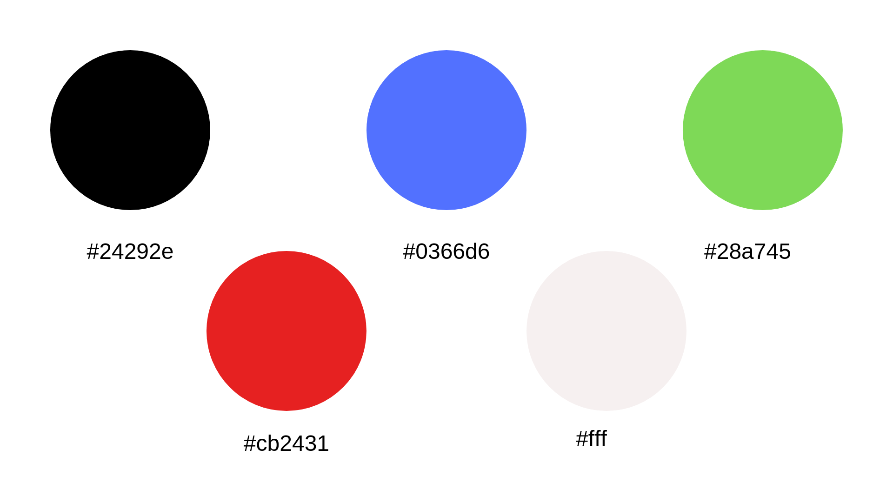
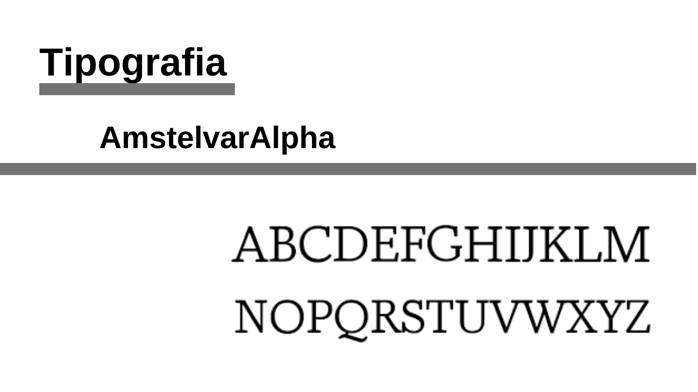

# Documento de Identidade Visual
***

## Histórico de Revisão
***

| Data | Descrição | Autor |
|:----:|:---------:|:-----:|
| 15/04/19 | Abertura do Documento de Identidade Visual | Brian Lui |
| 16/04/19 | Adição das imagens | Brian Lui |

***

## Manual de Identidade Visual
* HubCare

## Agenda
* Logo
* Paleta de Cores
* Descrição das Cores
* Tipografia
* Gráficos

## Logo

## Paleta de Cores
* As cores utilizadas foram baseadas nas cores do GitHub

## HubCare Collor Pallete

## Descrição das Cores

## Tipografia
* O Github utiliza a Topografia: -apple-
* Mas no HubCare será utilizado a Topografia: AmstelvarAlpha

## Descrição da Tipografia

## Gráficos

### Commits por dia

### Pull Requests 

### Taxa de Issues Marcadas com "Good First Issue", com "Help Wanted" e Issues ativas

### Check de Release Note, Presença de Guia de Contribuição, PR Template, Readme, Issue Template, Licença, Código de Conduta, Descrição do Repositório
