# Documento de Identidade Visual

## Histórico de Revisão

| Data | Descrição | Autor |
|:----:|:---------:|:-----:|
| 15/04/19 | Abertura do Documento de Identidade Visual | Brian Lui |
| 16/04/19 | Adição das imagens | Brian Lui |

## Manual de Identidade Visual
* HubCare

## Agenda
* Logo
* Paleta de Cores
* Descrição das Cores
* Tipografia
* Gráficos

## Logo

## Logo e Cores
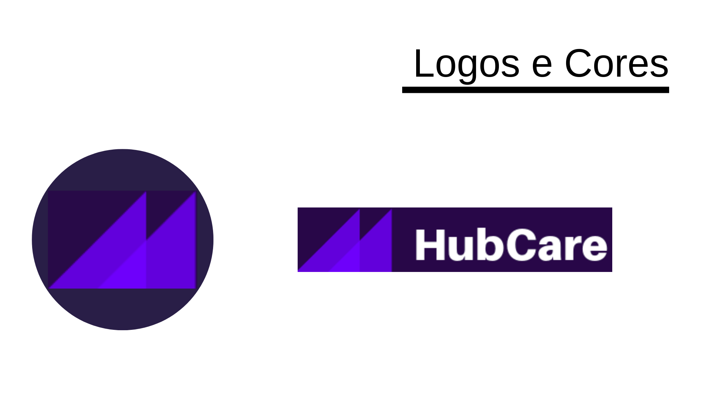

## Paleta de Cores
* As cores utilizadas foram baseadas nas cores do GitHub

## Cor Principal
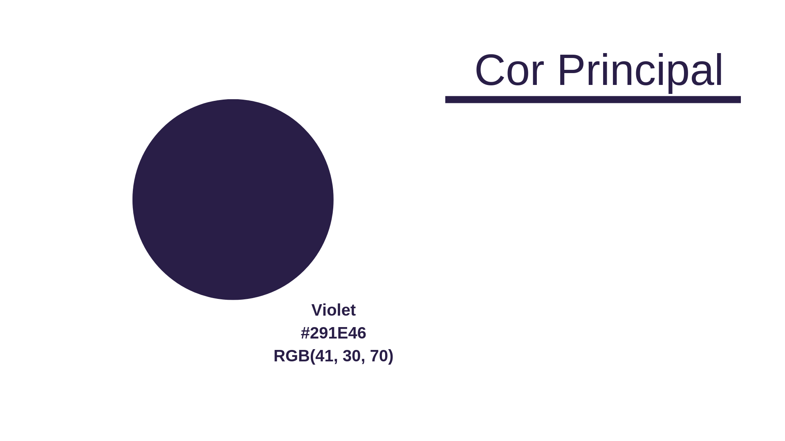

## Cores Secundárias
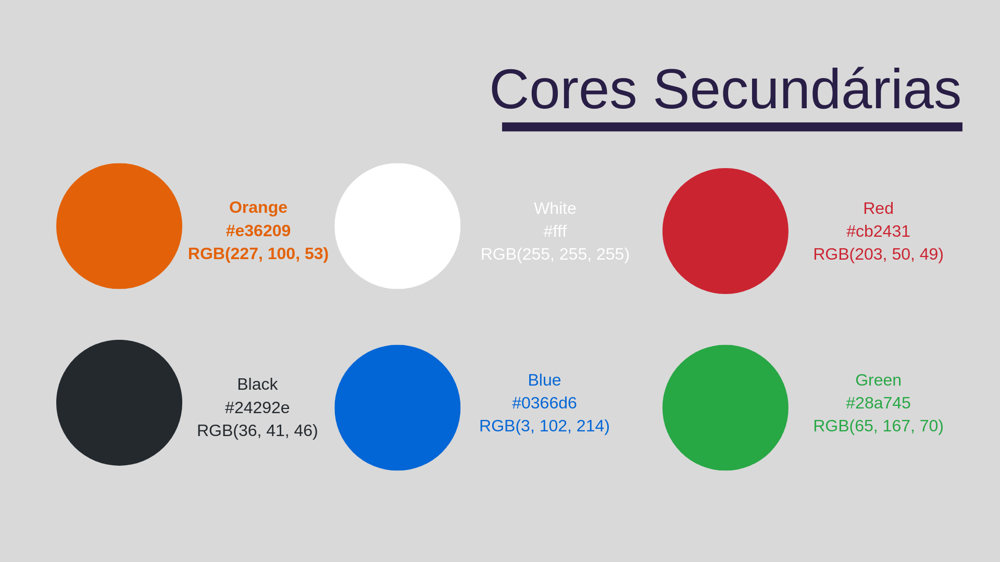

## Descrição das Cores
* A cor roxo será a Cor principal
* A cor preta será usada para os Headers, os Textos e para o gráfico de Contribuidores
* A cor azul será usada no gráfico de PRs
* A cor verde será usada no gráfico de Commits, de Porcentagem e de Checks
* A cor vermelha será usada no gráfico de Porcentagem
* A cor branca será usada para o fundo
* A cor laranja será usada para mostrar que está na aba HubCare

## Tipografia
* O Github utiliza a Topografia: -apple-
* Terminal Dosis para Textos
* Abhaya Libre para Títulos, Headers e Botões.

## Descrição da Tipografia
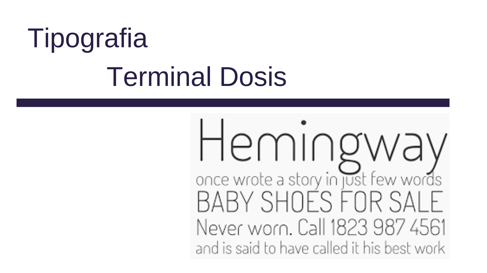

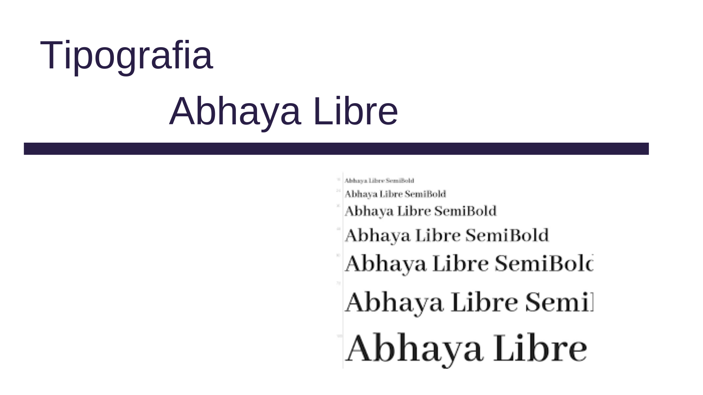

## Gráficos

### Atividade, Receptividade e Suporte
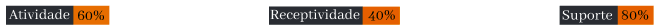

### Check de Release Note, Presença de Guia de Contribuição, PR Template, Readme, Issue Template, Licença, Código de Conduta, Descrição do Repositório
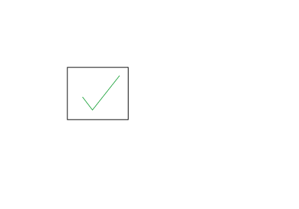

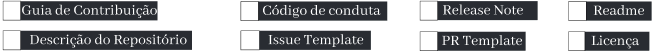

### Taxa de Issues Marcadas com "Good First Issue", com "Help Wanted" e Issues ativas
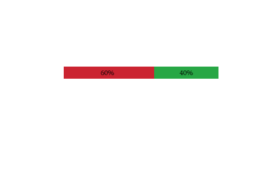

### Commits por dia
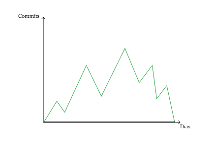

### Contribuidores dos últimos 30 dias
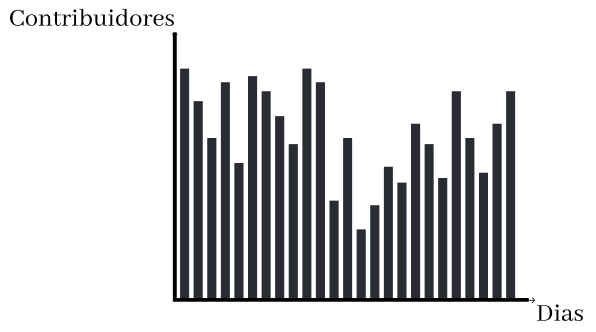

### Pull Requests 
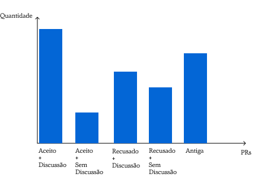