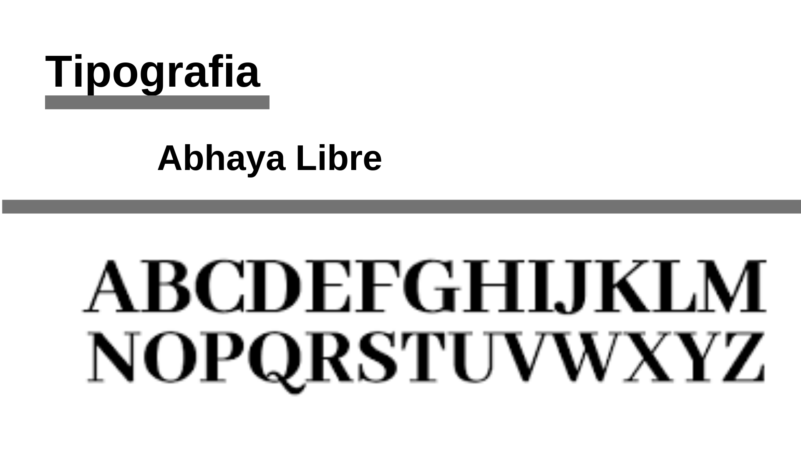

# Documento de Identidade Visual
***

## Histórico de Revisão
***

| Data | Descrição | Autor |
|:----:|:---------:|:-----:|
| 15/04/19 | Abertura do Documento de Identidade Visual | Brian Lui |
| 16/04/19 | Adição das imagens | Brian Lui |

***

## Manual de Identidade Visual
* HubCare

## Agenda
* Logo
* Paleta de Cores
* Descrição das Cores
* Tipografia
* Gráficos

## Logo
Na logo se encontra 2 mãos segurando a Logo do Github, para se denotar a idéia de cuidado, de saúde. Pois o HubCare irá analisar a saúde dos repositórios.

## Paleta de Cores
* As cores utilizadas foram baseadas nas cores do GitHub

## HubCare Collor Pallete

## Descrição das Cores
* A cor preta será usada para os Headers, os Textos e para o gráfico de Contribuidores
* A cor azul será usada no gráfico de PRs
* A cor verde será usada no gráfico de Commits, de Porcentagem e de Checks
* A cor vermelha será usada no gráfico de Porcentagem
* A cor branca será usada para o fundo
* A cor laranja será usada para mostrar que está na aba HubCare

## Tipografia
* O Github utiliza a Topografia: -apple-
* No HubCare será utilizado a Topografia: AmstelvarAlpha para Textos e Abhaya Libre para Headers. Foi usada essas tipografias, pois se assemelha bastante a tipografia -apple-.

## Descrição da Tipografia

## Gráficos

### Commits por dia

### Pull Requests 

### Contribuidores dos últimos 30 dias

### Taxa de Issues Marcadas com "Good First Issue", com "Help Wanted" e Issues ativas

### Check de Release Note, Presença de Guia de Contribuição, PR Template, Readme, Issue Template, Licença, Código de Conduta, Descrição do Repositório
